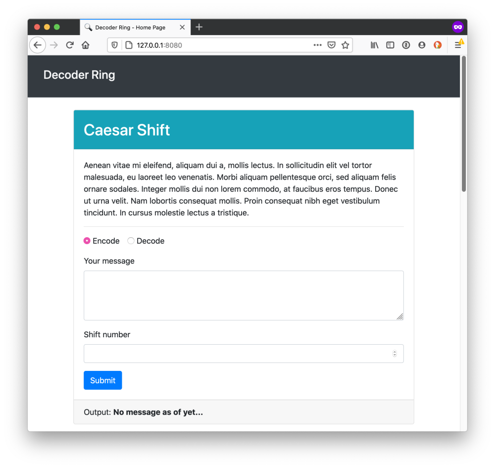

# Decoder-Ring-project

Built to be an encryption/decryption application to communicate and read top-secret messages.

## Functions

1. Allows users to use the Caesar shift cipher 
2. Allows users to use the Polybius square
3. Allows users to use the Substitution cipher

## Home View

## Built with:
Technology: JavaScript ES6, HTML5, Node.js, Bootstrap, Mocha, Chai.

